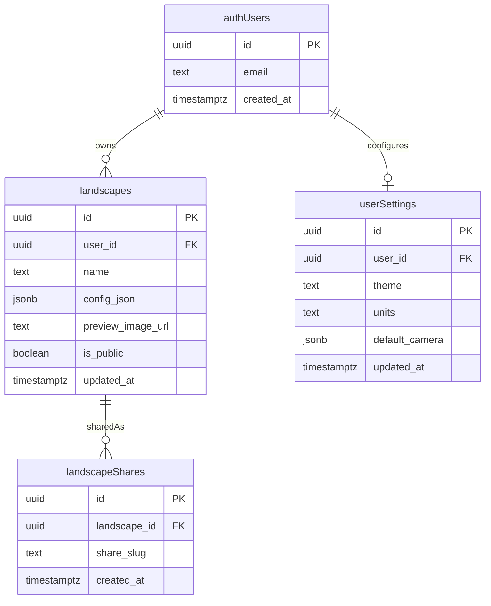

# Database Plan and Design

This document describes the Supabase Postgres data model used by the landscape app for authentication-bound persistence and (later) public sharing. The implementation lives in [supabase/schema.sql](c:\Ewan\Dev\3JS-Learn\supabase\schema.sql) and [supabase/policies.sql](c:\Ewan\Dev\3JS-Learn\supabase\policies.sql).

## Goals
- Store per-user terrain/landscape configurations.
- Enforce per-user access at the database layer with Row Level Security (RLS).
- Allow read-only public access for landscapes that have been explicitly shared.
- Keep the schema small, indexed, and easy to reason about for an MVP.

## Tables

### `auth.users` (managed by Supabase Auth)
- Owned by Supabase, not modified here.
- Provides `id` (uuid), `email`, `created_at`, etc.
- Referenced by `user_id` foreign keys in our tables.

### `public.user_settings`
Per-user app preferences. Created lazily on first save.
- `id` uuid, primary key, default `gen_random_uuid()`.
- `user_id` uuid, not null, default `auth.uid()`, FK to `auth.users(id)` on delete cascade, unique.
- `theme` text, not null, default `'default'`.
- `units` text, not null, default `'metric'`.
- `default_camera` jsonb, not null, default `'{}'::jsonb`.
- `created_at` timestamptz, not null, default `now()`.
- `updated_at` timestamptz, not null, default `now()`; refreshed by trigger.

### `public.landscapes`
User-owned landscape configurations.
- `id` uuid, primary key, default `gen_random_uuid()`.
- `user_id` uuid, not null, default `auth.uid()`, FK to `auth.users(id)` on delete cascade.
- `name` text, not null, length check between 1 and 120 characters.
- `config_json` jsonb, not null - serialized terrain/water/etc settings.
- `preview_image_url` text, nullable - optional thumbnail for gallery.
- `is_public` boolean, not null, default `false` - drives public read access.
- `created_at` timestamptz, not null, default `now()`.
- `updated_at` timestamptz, not null, default `now()`; refreshed by trigger.

### `public.landscape_shares` (planned, not in schema yet)
Optional table for slug-based public links if `is_public` toggling proves insufficient.
- `id` uuid, primary key.
- `landscape_id` uuid, FK to `public.landscapes(id)` on delete cascade.
- `share_slug` text, unique - human-friendly identifier in share URLs.
- `created_at` timestamptz, default `now()`.

## Indexes
- `landscapes_user_id_updated_at_idx` on `(user_id, updated_at desc)` - powers the user's recent-list query in `createLandscapeStore.list()`.
- `landscapes_public_idx` on `(is_public)` filtered to `is_public = true` - prepares for the public share view in Step 4.

## Triggers and Functions
- `public.set_updated_at()` - shared `before update` trigger function that sets `new.updated_at = now()`.
- Attached as:
  - `user_settings_set_updated_at` on `public.user_settings`.
  - `landscapes_set_updated_at` on `public.landscapes`.

## Row Level Security (RLS)

RLS is enabled on `public.user_settings` and `public.landscapes`. Both tables follow the rule: only the row owner (`auth.uid() = user_id`) can read/write. Landscapes additionally allow public read when `is_public = true`.

### `public.user_settings` policies
- `user_settings_select_own` - select to `authenticated` where `auth.uid() = user_id`.
- `user_settings_insert_own` - insert to `authenticated` with check `auth.uid() = user_id`.
- `user_settings_update_own` - update to `authenticated` using/with check `auth.uid() = user_id`.
- `user_settings_delete_own` - delete to `authenticated` where `auth.uid() = user_id`.

### `public.landscapes` policies
- `landscapes_select_own_or_public` - select to `anon, authenticated` where `is_public = true or auth.uid() = user_id`.
- `landscapes_insert_own` - insert to `authenticated` with check `auth.uid() = user_id`.
- `landscapes_update_own` - update to `authenticated` using/with check `auth.uid() = user_id`.
- `landscapes_delete_own` - delete to `authenticated` where `auth.uid() = user_id`.

## Entity Relationship Diagram

## Frontend Data Access

CRUD is wrapped in [src/persistence/createLandscapeStore.js](c:\Ewan\Dev\3JS-Learn\src\persistence\createLandscapeStore.js):
- `list()` - `select id, name, config_json, is_public, created_at, updated_at` ordered `updated_at desc`, limit 50.
- `save(name, config)` - insert `{ name, config_json: config }`; `user_id` defaults to `auth.uid()`.
- `rename(id, nextName)` - update `name` by id; RLS enforces ownership.
- `remove(id)` - delete by id.

UI integration lives in [src/ui/createLandscapeStoragePanel.js](c:\Ewan\Dev\3JS-Learn\src\ui\createLandscapeStoragePanel.js); session gating happens in [index.js](c:\Ewan\Dev\3JS-Learn\index.js) via the auth callback.

## Setup Instructions
1. Open the Supabase project's SQL Editor.
2. Run [supabase/schema.sql](c:\Ewan\Dev\3JS-Learn\supabase\schema.sql) (creates extensions, tables, indexes, triggers).
3. Run [supabase/policies.sql](c:\Ewan\Dev\3JS-Learn\supabase\policies.sql) (enables RLS and applies policies).
4. Verify with `select * from public.landscapes;` while signed in - expect 0 rows and no permission error.

## Operational Notes
- `pgcrypto` extension is required for `gen_random_uuid()`; the schema script enables it idempotently.
- `user_id default auth.uid()` lets the frontend insert without sending a user id; RLS still enforces ownership via `with check`.
- Reapplying the SQL files is safe: tables use `create table if not exists`, triggers/policies use `drop ... if exists` before re-creation.
- For destructive resets, drop tables manually before re-running the scripts.

## Future Schema Work (later steps)
- Step 4 (sharing): either flip `landscapes.is_public = true` and serve via `id`, or introduce `public.landscape_shares` for slug URLs.
- Step 5+ (gallery, presets): consider a `public.preset_landscapes` table seeded by an admin role.
- Add a storage bucket policy for `preview_image_url` if previews move from URL to uploaded files.
