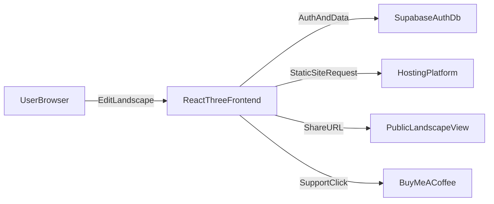

# Landscape Creator Website Plan

## Goals
- Let users create and customize landscapes in-browser.
- Persist user profiles and saved landscape configurations.
- Support sharing landscapes via link.
- Deploy on a free/low-cost hosting setup.
- Include a visible Buy Me a Coffee support link.

## Recommended MVP Stack (best speed/cost)
- **Frontend:** Vite + React + Three.js (reuse existing rendering work).
- **Auth + DB + API:** Supabase (free tier) using Postgres + Row Level Security.
- **Hosting:** GitHub Pages for frontend (free) **or** Netlify/Vercel free tier for easier env handling.
- **Recommendation:** Use Netlify/Vercel for MVP deployment simplicity; keep GitHub Pages as fallback if strictly required.

## Hosting Options (with trade-offs)
- **GitHub Pages**
  - Pros: free, simple static hosting, custom domain support.
  - Cons: environment-variable handling is less ergonomic for dynamic app configuration.
- **Netlify/Vercel (free tier)**
  - Pros: easier CI/CD, environment variable management, previews.
  - Cons: usage limits on free tier.
- **Cloudflare Pages (free tier)**
  - Pros: global CDN, strong free tier, good custom domain support.
  - Cons: slightly more setup choices for beginners.

## Database Options (cheapest/free)
- **Supabase Postgres (recommended)**
  - Free tier, built-in auth, SQL, RLS, good DX.
- **Firebase Firestore**
  - Generous free tier, easy client SDK.
  - Less relational than SQL for user/settings/history relations.
- **Neon Postgres + custom auth**
  - Free Postgres, but requires separate auth setup.

## Data Model (MVP)
- **users** (managed by auth provider)
  - id, email, created_at
- **user_settings**
  - id, user_id, theme, units, default_camera, updated_at
- **landscapes**
  - id (uuid), user_id, name, config_json, preview_image_url (optional), is_public, created_at, updated_at
- **landscape_shares** (optional if not using direct public IDs)
  - id, landscape_id, share_slug, created_at

## Core Flows
1. User signs in.
2. User edits landscape settings (terrain/water/lighting/atmosphere presets).
3. User saves configuration to DB.
4. User clicks Share and gets a public URL.
5. Shared URL loads saved config in viewer mode.
6. Buy Me a Coffee link available in top-right nav/footer.

## Architecture Overview

## Project Structure Plan
- Keep current rendering logic but modularize app shell/features:
  - [index.html](c:\Ewan\Dev\3JS-Learn\index.html)
  - [index.js](c:\Ewan\Dev\3JS-Learn\index.js)
  - [src/planet/createPlanet.js](c:\Ewan\Dev\3JS-Learn\src\planet\createPlanet.js)
  - [src/postprocessing/createWaterPost.js](c:\Ewan\Dev\3JS-Learn\src\postprocessing\createWaterPost.js)
- Add app layers (planned):
  - `src/app/App.jsx` (layout + routing)
  - `src/features/landscape/*` (editor state, serialization)
  - `src/features/auth/*` (sign-in/sign-up)
  - `src/features/share/*` (share page by id/slug)
  - `src/lib/supabaseClient.js`
  - `supabase/schema.sql` and `supabase/policies.sql`

## Security and Ownership Rules
- Enforce per-user access with Row Level Security:
  - Users can read/write only their own private landscapes.
  - Public landscapes readable by anyone via share endpoint.
- Validate incoming JSON config shape before save/load.

## Incremental Delivery Plan (publish after every step)
1. **Step 1: Foundation + First Publish**
   - Build app shell (`App`, routes, canvas container) and integrate current Three.js renderer.
   - Add landscape control panel for terrain/water/atmosphere settings (local state only).
   - Publish immediately to selected host as `v0.1` so the site is always live.

2. **Step 2: Auth + Second Publish**
   - Configure Supabase project and auth providers (email/password first).
   - Add sign up, sign in, sign out, and session persistence.
   - Publish as `v0.2` after auth smoke testing.

3. **Step 3: Save/Load + Third Publish**
   - Create `user_settings` and `landscapes` tables + RLS policies.
   - Implement save, list, rename, and load landscape configurations per user.
   - Publish as `v0.3` once CRUD paths pass functional tests.

4. **Step 4: Share Button + Fourth Publish**
   - Add Share button to generate public landscape URL.
   - Implement public read-only share page using `is_public` or share slug.
   - Publish as `v0.4` after validating incognito access to shared links.

5. **Step 5: Buy Me a Coffee + Fifth Publish**
   - Add Buy Me a Coffee CTA in header/footer and settings/about modal.
   - Add optional preset gallery polish and basic performance pass.
   - Publish as `v1.0` and configure custom domain if desired.

## Publish Workflow Used Between Every Step
- Work on a short-lived branch for each step.
- Run local smoke tests (render, auth, save, share as applicable).
- Merge to `main`.
- Automatic deploy triggers on host.
- Run post-deploy checks on live URL before starting next step.

## Success Criteria
- Logged-in user can save at least one landscape config.
- Saved landscapes are listed and reloadable.
- Share URL opens a public read-only view.
- Buy Me a Coffee link visible and functional.
- Site is deployed on free tier hosting with HTTPS.
