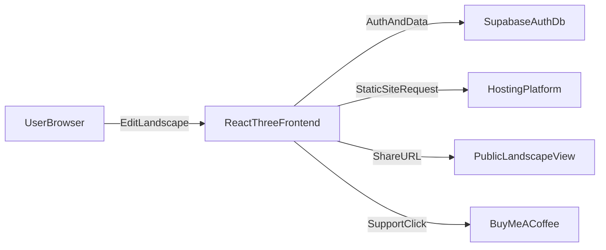
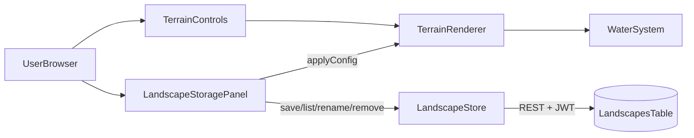

# Landscape Creator Website Plan

## Goals
- Let users create and customize landscapes in-browser.
- Persist user profiles and saved landscape configurations.
- Support sharing landscapes via link.
- Deploy on a free/low-cost hosting setup.
- Include a visible Buy Me a Coffee support link.

## Recommended MVP Stack (best speed/cost)
- **Frontend:** Vite + React + Three.js (reuse existing rendering work).
- **Auth + DB + API:** Supabase (free tier) using Postgres + Row Level Security.
- **Hosting:** GitHub Pages for frontend (free) **or** Netlify/Vercel free tier for easier env handling.
- **Recommendation:** Use Netlify/Vercel for MVP deployment simplicity; keep GitHub Pages as fallback if strictly required.

## Hosting Options (with trade-offs)
- **GitHub Pages**
  - Pros: free, simple static hosting, custom domain support.
  - Cons: environment-variable handling is less ergonomic for dynamic app configuration.
- **Netlify/Vercel (free tier)**
  - Pros: easier CI/CD, environment variable management, previews.
  - Cons: usage limits on free tier.
- **Cloudflare Pages (free tier)**
  - Pros: global CDN, strong free tier, good custom domain support.
  - Cons: slightly more setup choices for beginners.

## Database Options (cheapest/free)
- **Supabase Postgres (recommended)**
  - Free tier, built-in auth, SQL, RLS, good DX.
- **Firebase Firestore**
  - Generous free tier, easy client SDK.
  - Less relational than SQL for user/settings/history relations.
- **Neon Postgres + custom auth**
  - Free Postgres, but requires separate auth setup.

## Supabase Overview and Setup

### What Supabase Is
- Open-source backend platform (Firebase alternative) used here for the auth + database needs.
- Bundles features we need for this MVP:
  - **Postgres database** with auto-generated REST and realtime APIs.
  - **Authentication** (email/password, OAuth, magic links).
  - **Row Level Security (RLS)** for per-user data protection.
  - **Storage** for files (e.g., optional landscape preview images).
- Free tier is enough for the MVP scope of this project.

### Why It Fits This Project
- Single managed service covers auth + DB + API, removing the need for a custom backend.
- RLS lets us enforce "user can only read/write their own landscapes" at the database layer.
- Generates a Postgres connection plus a JS client (`@supabase/supabase-js`) usable directly from the Three.js frontend.

### Create the Supabase Project
1. Sign in at [https://supabase.com](https://supabase.com).
2. Click **New project**.
3. Choose the organization.
4. Fill in:
   - **Name**: e.g. `threejs-landscape`.
   - **Database password**: strong password, store securely.
   - **Region**: closest to target users.
5. Click **Create new project** and wait ~1-2 minutes for provisioning.

### Configure Authentication
1. **Authentication -> Providers**: enable **Email** (email/password) for MVP.
2. **Authentication -> URL Configuration**:
   - **Site URL**: deployed app URL (or `http://localhost:5173` during dev).
   - **Redirect URLs**: include both:
     - `http://localhost:5173`
     - Production URL (e.g. `https://<user>.github.io/<repo>/` if using GitHub Pages).

### Get the API Keys
- In **Project Settings -> API**, copy:
  - `Project URL` -> used as `VITE_SUPABASE_URL`.
  - `anon public key` -> used as `VITE_SUPABASE_ANON_KEY`.
- Never expose the `service_role` key in the frontend.

### Frontend Wiring (planned)
- Install client SDK: `npm i @supabase/supabase-js`.
- Create [src/lib/supabaseClient.js](c:\Ewan\Dev\3JS-Learn\src\lib\supabaseClient.js) using `createClient(import.meta.env.VITE_SUPABASE_URL, import.meta.env.VITE_SUPABASE_ANON_KEY)`.
- Local env via `.env.local`:
  - `VITE_SUPABASE_URL=...`
  - `VITE_SUPABASE_ANON_KEY=...`
- For deployment, store the same two values as host secrets/env vars (GitHub Actions secrets, Netlify/Vercel env vars).

## Data Model (MVP)
- **users** (managed by auth provider)
  - id, email, created_at
- **user_settings**
  - id, user_id, theme, units, default_camera, updated_at
- **landscapes**
  - id (uuid), user_id, name, config_json, preview_image_url (optional), is_public, created_at, updated_at
- **landscape_shares** (optional if not using direct public IDs)
  - id, landscape_id, share_slug, created_at

## Core Flows
1. User signs in.
2. User edits landscape settings (terrain/water/lighting/atmosphere presets).
3. User saves configuration to DB.
4. User clicks Share and gets a public URL.
5. Shared URL loads saved config in viewer mode.
6. Buy Me a Coffee link available in top-right nav/footer.

## Architecture Overview

## Project Structure Plan
- Keep current rendering logic but modularize app shell/features:
  - [index.html](c:\Ewan\Dev\3JS-Learn\index.html)
  - [index.js](c:\Ewan\Dev\3JS-Learn\index.js)
  - [src/planet/createPlanet.js](c:\Ewan\Dev\3JS-Learn\src\planet\createPlanet.js)
  - [src/postprocessing/createWaterPost.js](c:\Ewan\Dev\3JS-Learn\src\postprocessing\createWaterPost.js)
- Add app layers (planned):
  - `src/app/App.jsx` (layout + routing)
  - `src/features/landscape/*` (editor state, serialization)
  - `src/features/auth/*` (sign-in/sign-up)
  - `src/features/share/*` (share page by id/slug)
  - `src/lib/supabaseClient.js`
  - `supabase/schema.sql` and `supabase/policies.sql`

## Security and Ownership Rules
- Enforce per-user access with Row Level Security:
  - Users can read/write only their own private landscapes.
  - Public landscapes readable by anyone via share endpoint.
- Validate incoming JSON config shape before save/load.

## Incremental Delivery Plan (publish after every step)
1. **Step 1: Foundation + First Publish**
   - Build app shell (`App`, routes, canvas container) and integrate current Three.js renderer.
   - Add landscape control panel for terrain/water/atmosphere settings (local state only).
   - Publish immediately to selected host as `v0.1` so the site is always live.

2. **Step 2: Auth + Second Publish**
   - Configure Supabase project and auth providers (email/password first) - see "Supabase Overview and Setup" section above.
   - Add sign up, sign in, sign out, and session persistence using `supabase.auth` (`signUp`, `signInWithPassword`, `signOut`, `getSession`, `onAuthStateChange`).
   - Gate editor UI behind auth state; show login/signup form when logged out.
   - Add `VITE_SUPABASE_URL` / `VITE_SUPABASE_ANON_KEY` to local `.env.local` and to deployment env/secrets.
   - Publish as `v0.2` after auth smoke testing (sign up, sign out, sign back in, session persists across refresh).

3. **Step 3: Save/Load + Third Publish**
   - **Database setup (Supabase SQL editor)**
     - Run [supabase/schema.sql](c:\Ewan\Dev\3JS-Learn\supabase\schema.sql) to create `public.user_settings` and `public.landscapes` with `pgcrypto`, supporting indexes, and the shared `set_updated_at` trigger.
     - Run [supabase/policies.sql](c:\Ewan\Dev\3JS-Learn\supabase\policies.sql) to enable RLS and apply owner-only policies on both tables, plus public-read on `landscapes` for future share flow.
     - Verification: in SQL editor run `select * from public.landscapes;` while signed in as a fresh user - expect 0 rows and no permission error.
   - **Frontend persistence module** ([src/persistence/createLandscapeStore.js](c:\Ewan\Dev\3JS-Learn\src\persistence\createLandscapeStore.js))
     - `list()` returns recent rows ordered by `updated_at desc`, capped at 50.
     - `save(name, config)` inserts a row with `name` + `config_json` and returns the inserted row.
     - `rename(id, nextName)` updates `name` for one row; RLS enforces ownership.
     - `remove(id)` deletes one row by id.
     - All errors propagate as thrown `Error` instances containing the Supabase message.
   - **Editor wiring** ([index.js](c:\Ewan\Dev\3JS-Learn\index.js))
     - `getSerializableLandscapeConfig()` clones `terrainRenderer.settings` into `{ terrainSettings }`.
     - `applySavedLandscapeConfig(config)` calls `terrainRenderer.update`, syncs `waterSystem.updateSeaLevel`, and calls `terrainControls.setValues` so the controls UI reflects the loaded preset.
   - **Storage panel UI** ([src/ui/createLandscapeStoragePanel.js](c:\Ewan\Dev\3JS-Learn\src\ui\createLandscapeStoragePanel.js))
     - Top-right panel with name input, Save Current, and Refresh buttons.
     - List of saved landscapes with Load / Rename / Delete actions and a relative `updated_at` label.
     - Disabled until the user is signed in; auto-refreshes via the auth state callback.
   - **Auth gating**
     - `createAuthOverlay` callback toggles `storagePanel.setDisabled(!isSignedIn)` and calls `storagePanel.refresh()` on sign-in.
   - **Smoke tests (run locally and on live URL)**
     1. Sign in -> storage panel becomes enabled and lists 0 landscapes.
     2. Save with name "Island A" -> entry appears with current timestamp.
     3. Adjust sliders -> click Load on "Island A" -> terrain mesh, water sea level, and slider values revert to saved state.
     4. Rename "Island A" to "Island B" -> entry updates after refresh.
     5. Delete "Island B" -> entry disappears from list.
     6. Open a second account in an incognito window -> first account's rows are not visible (validates RLS).
     7. Refresh page after save -> session persists and list still shows saved rows.
   - **Publish v0.3**
     - Commit Step 3 changes, push to `main`, wait for GitHub Pages deploy.
     - Re-run smoke tests on the live URL.
     - Tag release `v0.3`.

4. **Step 4: Share Button + Fourth Publish**
   - Add Share button to generate public landscape URL.
   - Implement public read-only share page using `is_public` or share slug.
   - Publish as `v0.4` after validating incognito access to shared links.

5. **Step 5: Buy Me a Coffee + Fifth Publish**
   - Add Buy Me a Coffee CTA in header/footer and settings/about modal.
   - Add optional preset gallery polish and basic performance pass.
   - Publish as `v1.0` and configure custom domain if desired.

## Publish Workflow Used Between Every Step
- Work on a short-lived branch for each step.
- Run local smoke tests (render, auth, save, share as applicable).
- Merge to `main`.
- Automatic deploy triggers on host.
- Run post-deploy checks on live URL before starting next step.

## Success Criteria
- Logged-in user can save at least one landscape config.
- Saved landscapes are listed and reloadable.
- Share URL opens a public read-only view.
- Buy Me a Coffee link visible and functional.
- Site is deployed on free tier hosting with HTTPS.
